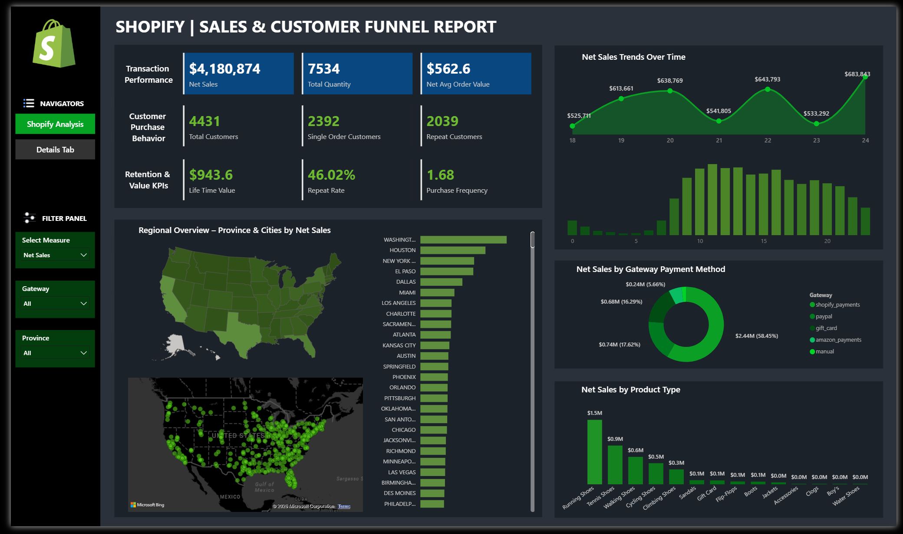
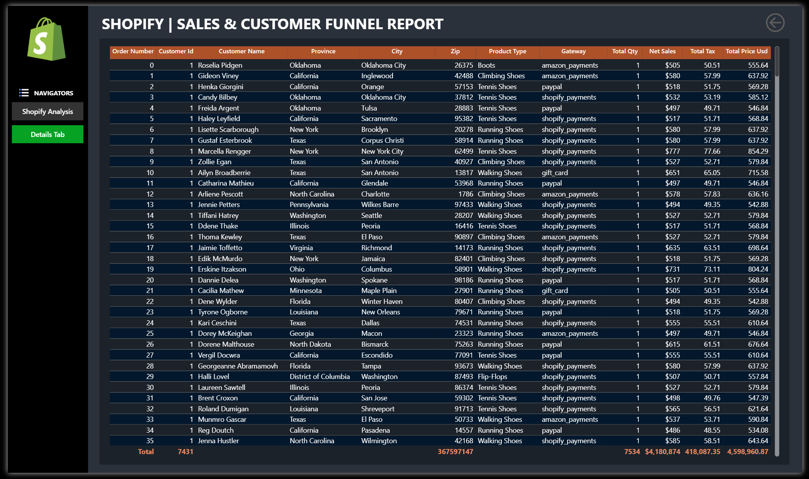

# 🛍️ Shopify Sales Analysis Dashboard

<p align="center">

</p>

<p align="center">


</p>

---

# 📖 Project Overview

The Shopify Sales Analysis Dashboard is an end-to-end Business Intelligence project developed using Power BI to analyze e-commerce sales performance, customer purchasing behavior, and long-term customer value. The dashboard transforms Shopify transaction data into meaningful visualizations, enabling businesses to monitor sales performance, identify customer trends, evaluate product performance, and support data-driven business decisions. :contentReference[oaicite:0]{index=0}

---

# 🎯 Business Problem

E-commerce businesses generate large volumes of transaction data every day, making it difficult to monitor sales performance, understand customer behavior, identify top-performing products, and measure customer retention. Without centralized reporting, valuable business insights can remain hidden.

This project addresses these challenges by developing an interactive Power BI dashboard that provides a comprehensive view of sales metrics, customer purchasing patterns, payment methods, product performance, and customer lifetime value, enabling stakeholders to optimize business strategies and improve overall performance. :contentReference[oaicite:1]{index=1}

---

# 🎯 Project Objectives

- Analyze overall Shopify sales performance.
- Monitor key sales and customer KPIs.
- Understand customer purchasing behavior.
- Measure customer retention and lifetime value.
- Identify high-performing products.
- Analyze payment gateway preferences.
- Track regional sales performance.
- Build an interactive dashboard for business decision-making. :contentReference[oaicite:2]{index=2}

---

# 📊 Dashboard Preview

The Shopify Sales Analysis Dashboard provides a comprehensive overview of e-commerce performance by combining sales, customer, and product analytics into an interactive reporting solution. The dashboard highlights important KPIs such as Net Sales, Total Quantity Sold, Total Customers, Average Order Value, Customer Lifetime Value (LTV), Repeat Customers, Purchase Frequency, and Repeat Rate. It also includes regional analysis through province and city maps, daily and hourly sales trends, payment gateway analysis, product category performance, and detailed transaction-level reporting, helping businesses understand customer behavior, optimize product offerings, improve retention strategies, and drive revenue growth. :contentReference[oaicite:3]{index=3}

<p align="center">

</p>

<br>

<p align="center">

</p>

---

# 💡 Business Insights

The dashboard helps answer several important business questions, including:

- What are the overall Net Sales and Total Quantity sold?
- How many unique customers have made purchases?
- What is the average order value?
- How many customers are repeat buyers?
- What is the customer Lifetime Value (LTV)?
- Which provinces and cities generate the highest sales?
- Which payment methods are most frequently used?
- Which product categories generate the highest revenue?
- What are the peak sales days and hours?
- How often do customers return to make purchases? :contentReference[oaicite:4]{index=4}

---

# 🛠️ Technologies Used

| Technology | Purpose |
|------------|---------|
| Power BI | Interactive Dashboard Development |
| Power Query | Data Cleaning & Transformation |
| DAX | KPI Calculations & Measures |
| Microsoft Excel | Data Preparation |
| Data Modeling | Star Schema Design |

---

# 🚀 Skills Demonstrated

- Business Intelligence
- E-commerce Analytics
- Sales Analytics
- Customer Analytics
- Data Cleaning
- ETL Process
- Data Modeling
- Power Query
- DAX Calculations
- KPI Development
- Dashboard Design
- Data Visualization
- Customer Segmentation
- Customer Retention Analysis
- Sales Trend Analysis
- Analytical Storytelling

---

# ⚙️ Project Workflow

```text
Raw Shopify Dataset
        │
        ▼
Microsoft Excel
(Data Validation & Initial Preparation)
        │
        ▼
Power Query
(Data Cleaning & Transformation)
        │
        ▼
Data Modeling
(Star Schema & Relationships)
        │
        ▼
DAX Measures & KPI Development
        │
        ▼
Interactive Power BI Dashboard
        │
        ▼
Business Insights & Decision Making
```
