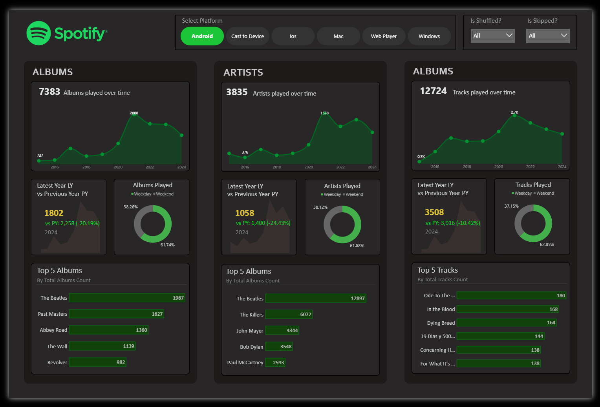
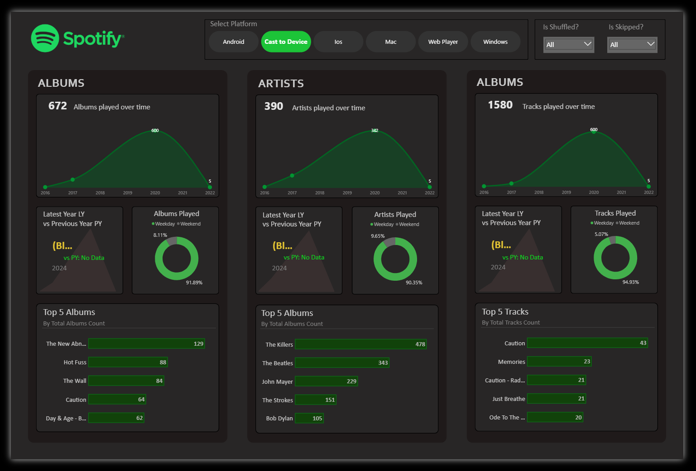
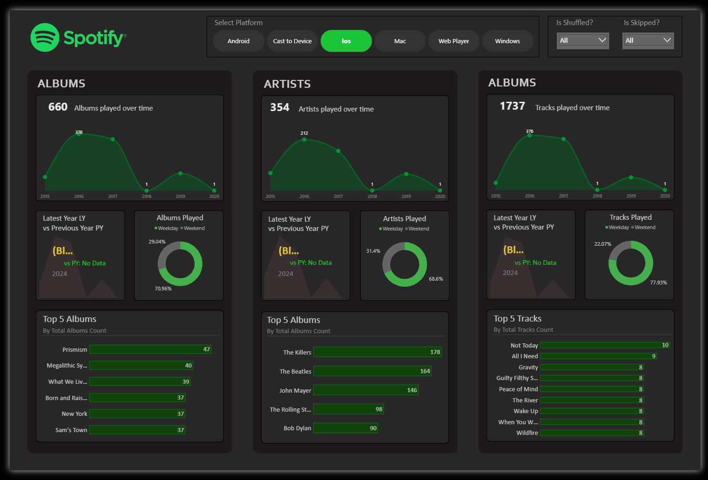
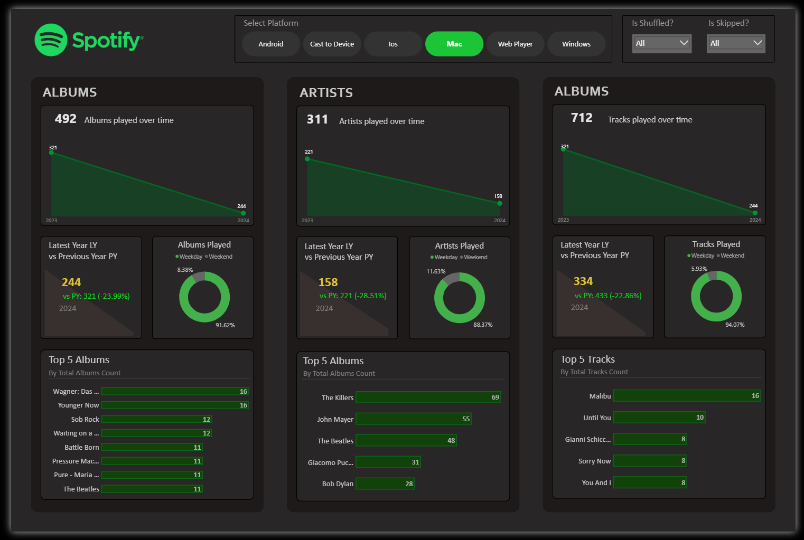
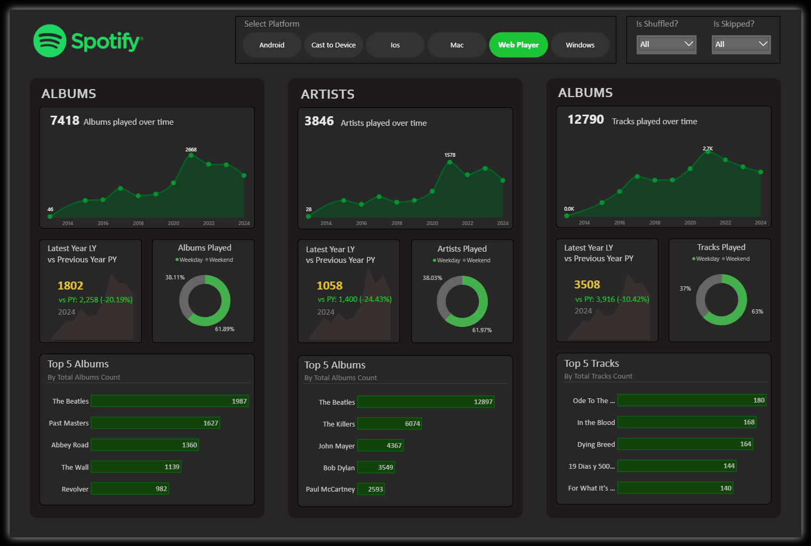
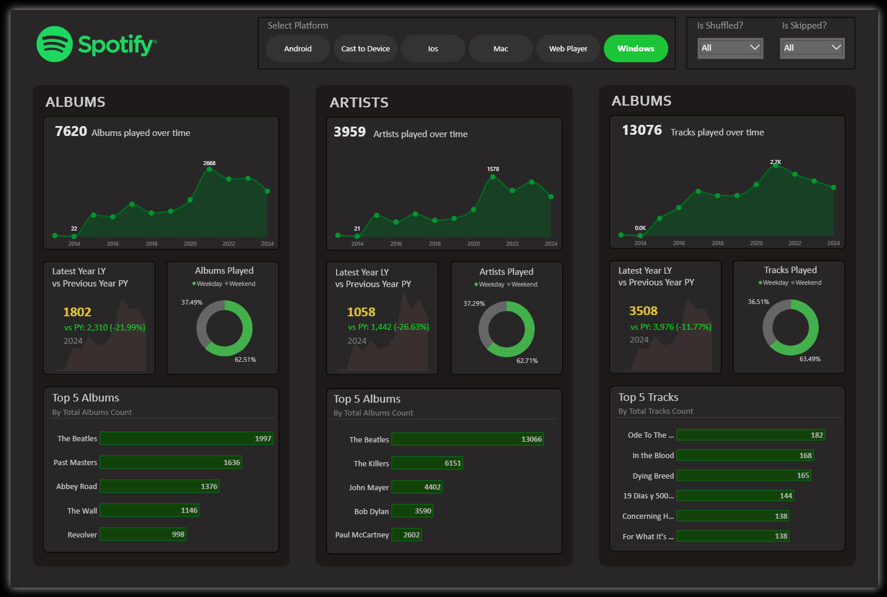
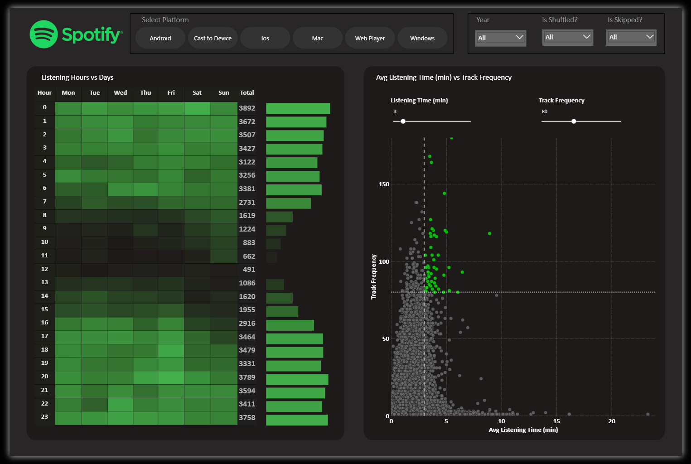
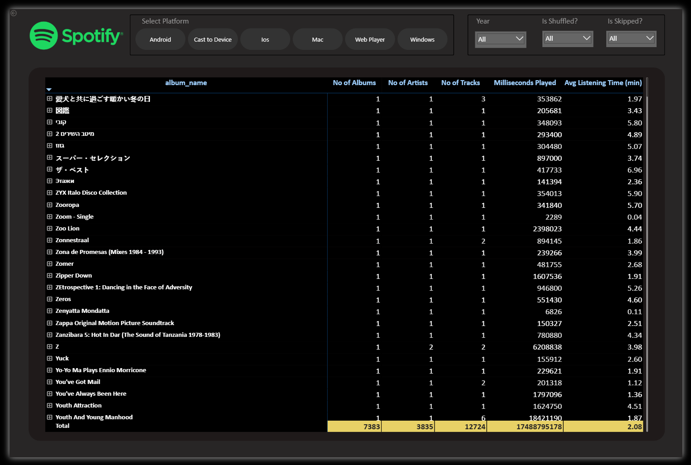

# 🎵 Spotify Analysis Dashboard

<p align="center">

</p>

<p align="center">


</p>

---

# 📖 Project Overview

The Spotify Analysis Dashboard is an end-to-end Business Intelligence project developed using Power BI to analyze music streaming behavior, user engagement, listening patterns, and platform performance. The dashboard transforms Spotify streaming data into interactive visualizations that help understand user preferences, artist popularity, playback behavior, and listening trends through meaningful business insights. :contentReference[oaicite:0]{index=0}

---

# 🎯 Business Problem

Music streaming platforms generate millions of listening records every day, making it challenging to understand user behavior, engagement levels, listening habits, and platform performance. Without an interactive analytics solution, identifying trends in artist popularity, skipped songs, playback sessions, and platform usage becomes difficult.

This project addresses these challenges by developing an interactive Power BI dashboard that enables users to analyze streaming activity, user engagement, listening duration, artist and album popularity, playback behavior, and platform usage patterns to support data-driven business decisions. :contentReference[oaicite:1]{index=1}

---

# 🎯 Project Objectives

- Analyze overall music streaming performance.
- Monitor user listening behavior.
- Identify the most played artists, albums, and tracks.
- Analyze playback duration and engagement.
- Understand song skip patterns.
- Compare listening activity across different platforms.
- Discover listening trends over time.
- Build an interactive dashboard for music analytics.

---

# 📊 Dashboard Preview

The Spotify Analysis Dashboard provides a comprehensive view of music streaming activity by combining user behavior, artist performance, playback patterns, and engagement metrics into interactive reports. The dashboard enables users to explore total streaming activity, listening duration, most played tracks, top artists, popular albums, platform usage, playback reasons, skip behavior, shuffle usage, and listening trends over time. It also provides detailed insights into user engagement, streaming sessions, listening preferences, and music consumption patterns, helping stakeholders understand audience behavior and optimize content strategies. :contentReference[oaicite:2]{index=2}

<p align="center">

</p>

<br>

<p align="center">

</p>

<br>

<p align="center">

</p>

<br>

<p align="center">

</p>

<br>

<p align="center">

</p>

<br>

<p align="center">

</p>

<br>

<p align="center">

</p>

<br>

<p align="center">

</p>

---

# 💡 Business Insights

The dashboard helps answer several important business questions, including:

- Which tracks receive the highest number of plays?
- Who are the most listened-to artists?
- Which albums are the most popular?
- How much time do users spend listening to music?
- Which platforms generate the highest streaming activity?
- How frequently are songs skipped before completion?
- How often do users enable shuffle mode?
- What are the most common reasons for starting and ending playback?
- What are the listening trends over time?
- How do users interact with Spotify across different devices? :contentReference[oaicite:3]{index=3}

---

# 🛠️ Technologies Used

| Technology | Purpose |
|------------|---------|
| Power BI | Interactive Dashboard Development |
| Power Query | Data Cleaning & Transformation |
| DAX | KPI Calculations & Measures |
| Microsoft Excel | Data Preparation |
| Data Modeling | Star Schema Design |

---

# 🚀 Skills Demonstrated

- Business Intelligence
- Data Analytics
- Music Streaming Analytics
- User Behavior Analysis
- Customer Engagement Analysis
- Data Cleaning
- ETL Process
- Data Modeling
- Power Query
- DAX Calculations
- KPI Development
- Dashboard Design
- Data Visualization
- Trend Analysis
- Analytical Storytelling

---

# ⚙️ Project Workflow

```text
Raw Spotify Streaming Dataset
        │
        ▼
Microsoft Excel
(Data Validation & Initial Preparation)
        │
        ▼
Power Query
(Data Cleaning & Transformation)
        │
        ▼
Data Modeling
(Star Schema & Relationships)
        │
        ▼
DAX Measures & KPI Development
        │
        ▼
Interactive Power BI Dashboard
        │
        ▼
User Behavior Insights & Business Decision Making
```
